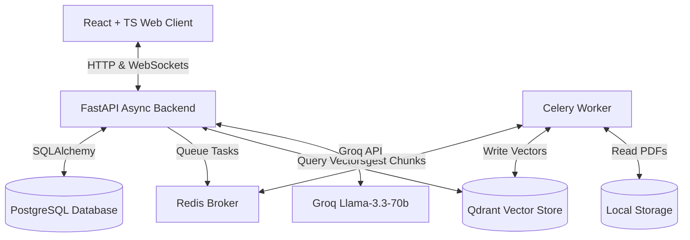

# RAG Document QA System

A production-grade, enterprise-scale SaaS application designed for document ingestion, asynchronous vector embedding indexing, and grounded Retrieval-Augmented Generation (RAG) chat. Users can upload documents (PDF and TXT), view real-time ingestion status and system performance telemetry on a dashboard, and chat with a Groq-powered AI support agent that generates grounded responses complete with exact document page-level citations.

---

## 🏗️ Architecture & Technical Stack

The project features a decoupled, multi-service setup optimized for local host development and containerized service bindings:



### Backend (Python & FastAPI)
*   **FastAPI:** Asynchronous framework handling REST endpoints and real-time streaming over state-aware WebSocket connections (`/api/ws/chat/{conversation_id}`).
*   **SQLAlchemy ORM:** Relational database integration mapping tables for users, documents, celery job logs, chat messages, and telemetry.
*   **Alembic:** Handles relational database migrations.

### Ingestion & RAG Orchestration (LlamaIndex & Celery)
*   **Celery + Redis:** Asynchronous background worker queue. When a document is uploaded, Celery parses, chunks, and embeds it without blocking main web threads.
*   **LlamaIndex:** Framework orchestration.
*   **HuggingFace Embeddings:** Computes vector representations locally on the host using `BAAI/bge-small-en-v1.5` (producing 384-dimensional cosine similarity vectors).
*   **Qdrant:** Vector Database storing the vectorized chunks and associated metadata (e.g., document ID, page number, original text).

### Large Language Model (Groq)
*   **Groq API:** Utilizes the high-speed **`llama-3.3-70b-versatile`** chat completions model.
*   **Grounded Prompts:** Strict system constraints prevent model hallucinations. It only uses retrieved vector chunks and falls back to a standardized refusal if context is missing.
*   **Deterministic Configuration:** Evaluates using `temperature=0.0` to guarantee factual accuracy and prevent text-completion token loops.

### Frontend (React & TypeScript)
*   **Vite + React + TypeScript:** Highly responsive UI structure compiled cleanly with strict type bindings.
*   **Tailwind CSS:** Styled with a premium glassmorphic dark-theme design.
*   **Dynamic Views:**
    *   **Metrics Dashboard:** Displays KPI statistics, database tables, and Celery job logs.
    *   **Document Manager:** Drag-and-drop workspace that supports file uploading (up to 20MB), pages/chunks details parsing, and vector data removal actions.
    *   **AI Support Chat:** Multi-session chat interface with token-by-token text streaming and inline source citations.

---

## 🗄️ Database Schema & Entities

The system maintains a clean relational mapping in PostgreSQL:

1.  **User (`users`):** Stores credentials, roles (`ADMIN` or `SUPPORT`), and timestamps.
2.  **Document (`documents`):** Contains uploaded file paths, metadata, page counts, chunk metrics, and status (`UPLOADED`, `PROCESSING`, `INDEXED`, `FAILED`).
3.  **ProcessingJob (`processing_jobs`):** Tracks background celery tasks, timestamps, and parsing errors.
4.  **Conversation (`conversations`):** Organizes user chat sessions.
5.  **Message (`messages`):** Holds chat messages, roles (`USER` / `ASSISTANT`), content text, and a JSONB list of cited vector sources.
6.  **RetrievalLog & AIResponseLog (`retrieval_logs`, `ai_response_logs`):** Stores performance telemetry (database query latency, LLM generation time, token counts).

---

## 🚀 Running the Application Locally

The infrastructure (PostgreSQL, Redis, Qdrant) is fully containerized under Docker Compose, while application servers run locally on the host to support hot-reloading.

### 1. Prerequisites
Ensure you have Docker, Python 3.12+, and Node.js 20+ installed.

### 2. Start Infrastructure Containers
In the root directory, spin up Redis and Qdrant:
```bash
docker compose up redis qdrant -d
```
*(Note: Relational data is backed by Supabase via transaction poolers on port `6543`, so you do not need to run a local PostgreSQL container).*

### 3. Launch Backend API Server
Navigate to the backend directory, install python dependencies, and launch Uvicorn:
```bash
cd backend
pip install -r requirements.txt
uvicorn app.main:app --reload
```
The server will start on `http://localhost:8000`.

### 4. Start Celery Background Worker
Open a new terminal window in the backend directory and launch the worker:
```bash
cd backend
celery -A app.worker.celery_app.celery worker --loglevel=info --pool=solo
```

### 5. Launch React Frontend Client
Open a third terminal window, navigate to the frontend directory, install npm packages, and start the development server:
```bash
cd frontend
npm install
npm run dev
```
The client will start on `http://localhost:5173`.

---

## 🔑 Developer Credentials

Use the following seeded accounts to log in and test the permissions system:

*   **System Administrator (Access to Dashboard, Document Manager, & Chat):**
    *   **Email:** `admin@company.com`
    *   **Password:** `adminpassword`
*   **Support Agent (Access to AI Chat only):**
    *   **Email:** `agent@company.com`
    *   **Password:** `agentpassword`

---

## 🛠️ Key Improvements & Bug Fixes Added

*   **Resolved Database Field Bug:** Removed broken SQLAlchemy methods inside Celery tasks and replaced them with standard Python UTC datetime assignments.
*   **Upgraded Decommissioned Model:** Migrated the LLM backend from the decommissioned `llama3-70b-8192` to Groq's active `llama-3.3-70b-versatile` model.
*   **Fixed WebSocket Session Disconnections:** Refactored the frontend chat view to bind state updates to a React reference object (`activeConvRef`), preventing state-refresh loops from closing the session.
*   **Eliminated LLM Repetition Loops:** Converted the query pipeline from `stream_complete` to `stream_chat` with role-based message lists. Set `temperature=0.0` and refined prompt guidance to forbid meta-commentary, resolving token loop repeating issues.
*   **Introduced Polite Conversational Greetings:** Updated system prompt parameters so the agent responds to greetings (e.g. *"hi"*, *"hello"*) naturally, while keeping grounding constraints strictly active for policy questions.
